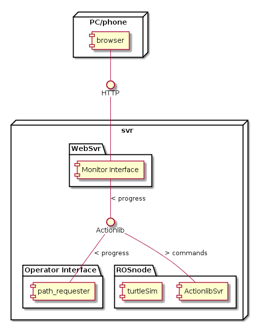

# Turtlesim challenge - Statement of Work

## Introduction

The Client is looking for a contractor who can rovide a **tele-operated robot**, with a **web application**. The Client has some technical skills which allows her to participate in an Agile development as the Product Owner, thusly is asking for a first iteration resulting in a Minimum Viable Product, as a trial. If the sprint meets her expectations, a **long term contract** will be signed to code the complete
salable product from the ground up.

The Contractor has the required expertise and is willing the participate
in the trial.

## Requirements

1.  Functional requirements:

    1.  Robot shall perform missions specified by Operator:

        1.  Go from the current point to any other goal point in 2D
            space
        2.  The path shall be specified by Operator, in 2D space
        3.  The goal is static and may have a considerable tolerance

    2.  A Web interface shall allow Monitor to:

        1.  track Robot’s trajectory and drawings.

    3.  An interface shall allow Operator to:

        1.  specify a mission (goal, path, speed)
        2.  dynamically change Robot’s speed during a mission
        3.  have a visual and/or textual representation of Robot’s current state ( x, y, theta, linear velocity, and angular velocity, In/Off-Goal/Idle/Paused)
        4.  pause and resume Robot’s movement
        5.  abort the current mission (Robot to Idle state)

2.  MVP structure (non-functional):

    1.  Web interface for Monitor (featuring a read-only Actionlib client)
    2.  Interface for Operator (featuring an Actionlib client)
    3.  Rosnode, a Robot Operating System[ROS] node with Actionlib server
    4.  Robot, a robot simulated with a turtlebot instance of the turtlesim package in Rosnode
    5.  launchfiles shall be provided (with Contractor’s requisites in place)
    6.  ROS node(s) and the web application should work on an Ubuntu 16.04 box and Google Chrome.

3.  constraints (non-functional):

    1.  Python3 programming language and APIs shall be used for Operator’s interface
    2.  Monitor interface shall leverage [ROSlibjs](http://wiki.ros.org/roslibjs)

## Scope of work

1.  MVP implementation packages:

    1.  Rosnode
    2.  Operator Interface
    3.  Monitor Interface (web server and app)

2.  Deliverables:

    1.  This SoW, agreed by all the stakeholders
    2.  Documentation, launchfiles, source code and binaries for the entire system
    3.  Public Github.com repository
    4.  Demonstration meeting: a 30 minutes presentation on Client’s premises for the entire system
    5.  Retrospection Meeting: 30 minutes interview presenting details of the product, the process, tools.

## Stakeholders

-   Client: the project owner
-   Product Owner: a person on the Client’s organization
-   Monitor: role on the Client’s organization
-   Operator: role on the Client’s organization
-   Contractor: the MVP contractor

## Period of performance

Unless otherwise required, the end of the project is set to the 10th
working day after the acceptance of this document. The meeting should
take place the next business day or at the Client’s earliest
convenience.

## Acceptance Criteria

-   The documentation will be written in English
-   The source code will:
    -   run as requested, provided all dependencies are met and
        launchfiles are used
    -   be autodocumented according to suitable Python Enhancement
        Proposals [PEP]
    -   accompanied with test cases covering the requirements
-   Deliverables are handed-in within the specified time frame and
    mechanisms.

## Scope extension

The scope might be extended with the following optional requirements:

- Use two (or more) turtles to draw the figure instead of the path of a single turtle. The number of turtles would be specified along with the path to follow.
- Allow the user to pause and resume motion of the turtle X from the web page.

## References and relevant standards

\[ROS\] Powering the world’s robots. (n.d.). Retrieved September 25,
2017, from http://www.ros.org/

\[PEP\] Index of Python Enhancement Proposals (PEPs). (n.d.). Retrieved
September 25, 2017, from https://www.python.org/dev/peps/

