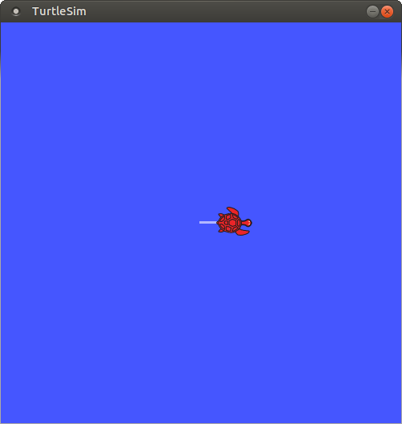
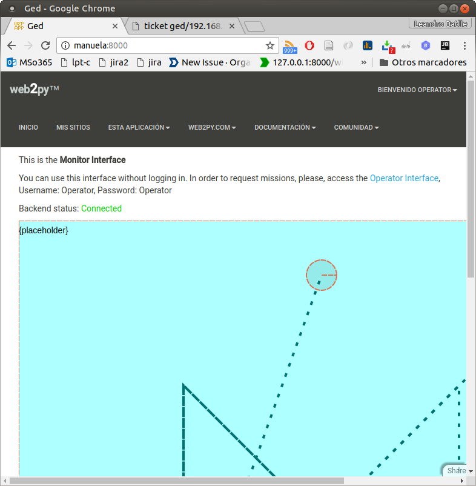

# Ged: User's Manual

## Introduction

See [Statement of work](SoW.md)

## Installation

On a fresh Ubuntu 16.04 installation (*MATE* edition  recommended), open a terminal window and type:

```bash
apt-get install ros-kinetic-fulldesktop
git clone orga.batlle.com.ar:8001:/Ekumen/challenge
cd challenge
./ged_pkg install
```

The package **Ged** should be part of your ROS installation.   


### testing the installation

* [ ] logout and in again (in order to have the new enviromental variables in place). 
* [ ] On a terminal window type:

```bash
roslaunch ged ged.launch
```

A TurtleSim window should popup. 

* [ ] On a *new* terminal window type:

```bash
rosrun ged ged_client.py
```

The icon in the TurtleSim window should move a bit:

   
<sup>note: robot's icon might differ</sup>

* [ ] Shutdown the testing nodes by pressing CTRL-C in the first terminal window.   


### Troubleshooting

* [ ]  If previous launched process are still running terminate them.

* [ ]  If the web interface is not reachable, please, verify that port 8000/TCP is not in use. Then ```cd``` to directory where the project was originally cloned, and type:
```bash
cd Websvr/web2py
python web2py -i 0.0.0.0
```
Point your browser to your computers address, port 8000. Por example:

- http://localhost:8000/ (from the same computer)   
- http://yourComputer:8000/ (from the another computer, a cellhpone, etc)   
 

* [ ] repeat the *"roslaunch ..."*  step with the **-v** modifier. This is an example of a normal output:

```
$ roslaunch -v ged ged.launch
... logging to roslaunch-LinuxUM1604-17347.log
Checking log directory for disk usage. This may take awhile.
Press Ctrl-C to interrupt
Done checking log file disk usage. Usage is <1GB.

... loading XML file [/opt/ros/kinetic/etc/ros/roscore.xml]
... executing command param [rosversion roslaunch]
Added parameter [/rosversion]
... executing command param [rosversion -d]
Added parameter [/rosdistro]
Added core node of type [rosout/rosout] in namespace [/]
... loading XML file [/opt/ros/kinetic/share/ged/launch/ged.launch]
Added parameter [/ged/turtlesim_node/speed/default]
Added node of type [turtlesim/turtlesim_node] in namespace [/ged/]
Added node of type [ged/ged_server.py] in namespace [/ged/]
started roslaunch server http://LinuxUM1604:45253/

SUMMARY
========

PARAMETERS
 * /ged/turtlesim_node/speed/default: 3.0
 * /rosdistro: kinetic
 * /rosversion: 1.12.7

NODES
  /ged/
    ged_server_py (ged/ged_server.py)
    turtlesim_node (turtlesim/turtlesim_node)

auto-starting new master
process[master]: started with pid [17358]
ROS_MASTER_URI=http://localhost:11311

setting /run_id to 48111368-a80d-11e7-bd2d-080027c3860e
process[rosout-1]: started with pid [17371]
started core service [/rosout]
process[ged/turtlesim_node-2]: started with pid [17375]
process[ged/ged_server_py-3]: started with pid [17385]
```


* [ ] run ```rqt_graph```

```bash
$ rqt_graph
```

The nodes in place should be:

   
<sup> note: please, mind the ticks in the "Group" and "Hide" boxes.</sup> 

## Usage


### How to run Ged

* [ ] Run the server nodes and web interfaces. On a *new* terminal window, ```cd``` to directory where project was cloned, and type:

```bash
./ged_pkg start
```

A TurtleSim window should popup. Otherwise, refer to the Troubleshooting section of this manual.

Point your browser to your computers address, port 8000. Por example:

* http://localhost:8000/ (from the same computer)   
* http://yourComputer:8000/ (from the another    computer, a cellhpone, etc)




## Uninstall

On a *new* terminal window, ```cd``` to directory where the project was originally cloned, and type:
```bash
./ged_pkg remove_pkg
```
